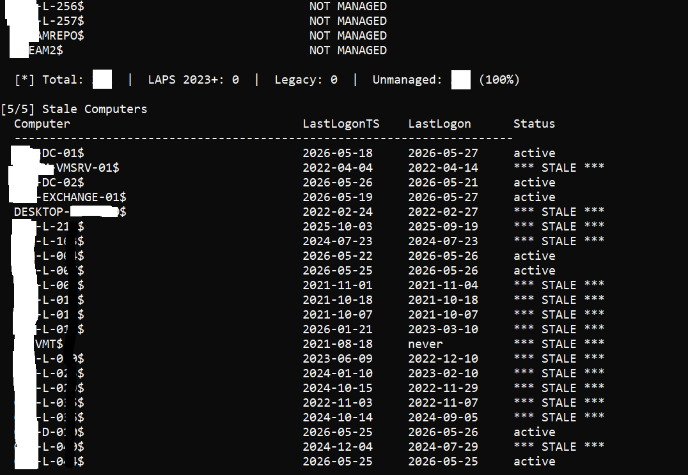
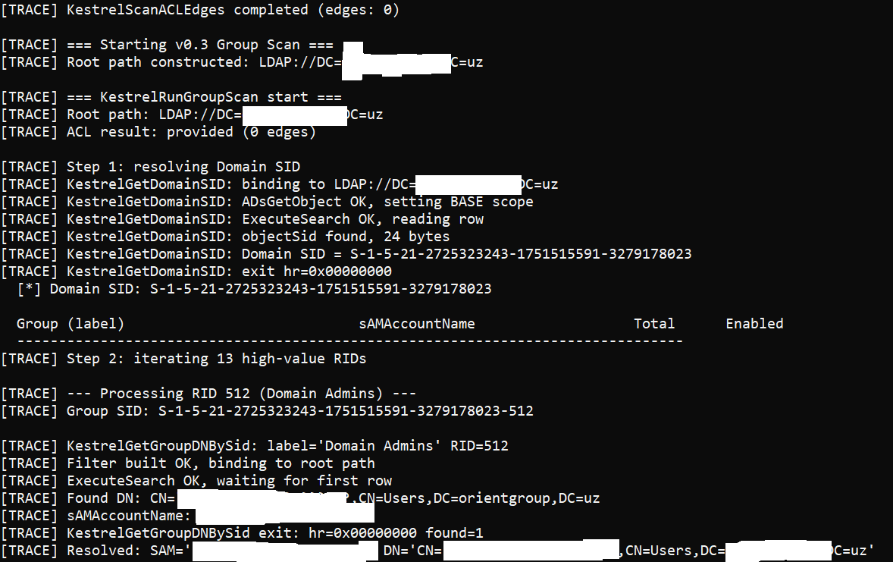

# Kestrel

Passive Active Directory security enumeration via native ADSI/COM interfaces.  
No .NET. No PowerShell. No managed runtime. No detectable behavioral signature.

---

## The problem with existing tooling

If you work in AD security, you know BloodHound. It maps attack paths through delegation chains, ACL edges, and group memberships, and it does it well. The problem is not what it does. The problem is how it does it.

SharpHound, BloodHound's collector, runs as a .NET assembly. It generates LDAP traffic in patterns that no legitimate domain workstation produces. EDR solutions detect it & not because it exploits anything, but because the behavioral signature is unmistakable. Same story with ADRecon, PowerView, and most Python-based alternatives: the runtime is the fingerprint.

This is an unsolved problem for defenders running internal audits. You need to enumerate your own domain to find misconfigurations before an attacker does, but every available tool announces itself loudly.

## A different approach

Windows has had a native AD interface since Windows 2000: **ADSI** - Active Directory Service Interfaces. It is a COM-based abstraction over LDAP that the OS itself uses when domain-joined components query the directory. Group Policy processing uses it. The MMC snap-ins use it. `net user /domain` uses it.

The traffic it produces is indistinguishable from normal domain activity because it *is* normal domain activity.

This is the foundation Kestrel is built on.

## How it works

Kestrel is written in pure C using ADSI COM interfaces directly: no wrappers, no abstractions. From the wire's perspective, every query is an authenticated LDAP bind followed by paged search requests. Exactly what every DC sees from every domain workstation, every minute of every day.

```c
IDirectorySearch *pSearch = NULL;
ADsGetObject(ldapPath, &IID_IDirectorySearch, (void **)&pSearch);
pSearch->lpVtbl->SetSearchPreference(pSearch, prefs, 2);
pSearch->lpVtbl->ExecuteSearch(pSearch, filter, attrs, count, &hSearch);
```

Groups are resolved by **Well-Known RID + Domain SID**, not by name. This means Kestrel works correctly on domains installed in any language (English, Russian, German, etc.) without hardcoded group name strings.

## Requirements

- Windows, domain-joined machine
- Authenticated domain user account (no elevated privileges required for most scans)
- Visual Studio 2019+ with Windows SDK
- Linked libraries: `activeds.lib`, `adsiid.lib`, `ws2_32.lib`, `advapi32.lib`

## Build

Open `Kestrel.sln` in Visual Studio, select **Release | x64**, build.

For a self-contained binary with no runtime DLL dependencies:  
Project Properties → C/C++ → Code Generation → Runtime Library → **Multi-threaded (/MT)**

## Modules

### v0.1 Five passive scans (`adws_scan.c`)

All queries are read-only. Zero packets sent to target hosts.

| Module | What it does |
|---|---|
| **ADWS Endpoint Detection** | Probes port 9389/TCP per DC. Raw TCP connect, SO_ERROR verification, no WCF framing. |
| **Computer Topology** | Full computer inventory with SPN-based service inference. MSSQLSvc → SQL Server, WSMAN → WinRM, TERMSRV → RDP. One LDAP query covers the entire domain. |
| **Delegation Risks** | Separates three categories: unconstrained delegation (TGT forwarding), constrained delegation (msDS-AllowedToDelegateTo), and Protocol Transition / S4U2Self (UAC 0x1000000). Reported separately - different risk profiles. |
| **LAPS Coverage** | Detects legacy LAPS (ms-Mcs-AdmPwdExpirationTime) and Windows LAPS 2023+ (msLAPS-EncryptedPasswordHistory). Splits computer population into managed/unmanaged with percentage breakdown. |
| **Stale Computers** | Uses lastLogonTimestamp as primary reference, it replicates across DCs, unlike lastLogon which is per-DC only. Both values reported side by side. |

### v0.2 ACL edge extraction (`KestrelACL.C`)

Enumerates all AD objects (user, group, computer, OU, domainDNS, container, GPO, builtinDomain) and extracts DACL edges.

Extended Rights GUID→name mapping is built dynamically from `CN=Extended-Rights,CN=Configuration` - no hardcoded GUID tables.

Classified edge types: `GenericAll`, `WriteDACL`, `WriteOwner`, `GenericWrite`, `ExtendedRight`, `WriteProperty`, `CreateChild`, `DeleteChild`, `Self`.

Two read modes:
- **Plan A** - per-object `IDirectoryObject` bind (requires elevated rights in some environments)
- **Plan B** - reads `nTSecurityDescriptor` directly from LDAP search column (works for any authenticated domain user, same approach as BloodHound)

Plan A is attempted first. On first access denial, Kestrel switches to Plan B automatically for all remaining objects.

### v0.3 Transitive group membership (`KestrelGroup.c`)

Expands high-value groups using `LDAP_MATCHING_RULE_IN_CHAIN` (OID `1.2.840.113556.1.4.1941`).

One LDAP query per group. The DC performs full recursive traversal server-side, no client-side BFS.

Groups are located by **RID**, not by name:

| RID | Group |
|---|---|
| 512 | Domain Admins |
| 518 | Schema Admins |
| 519 | Enterprise Admins |
| 520 | Group Policy Creator Owners |
| 521 | Read-only Domain Controllers |
| 526 | Key Admins |
| 527 | Enterprise Key Admins |
| 548–551 | Account/Server/Print/Backup Operators |

After expansion, cross-references group membership against ACL edges from v0.2 to surface attack paths: `member → [via group] → EdgeType → target`.

## Roadmap

| Version | Status | Description |
|---|---|---|
| v0.1 | ✅ | Five passive AD scans |
| v0.2 | ✅ | ACL edge extraction via IDirectoryObject |
| v0.3 | ✅ | Transitive group membership via LDAP_MATCHING_RULE_IN_CHAIN |
| v0.4 | 🔲 | In-memory graph from ACL + membership + delegation data. JSON export. |
| v0.5 | 🔲 | BFS path finder. Attack path analysis: any principal → Domain Admins, shortest route. |

## Screens


## Code quality

**SAL 2.0 annotations** on every function signature  validated by PREfast (`/analyze`) at compile time. `_Must_inspect_result_` on HRESULT-returning functions, `_Outptr_` vs `_Out_` where semantics differ.

**Single rootDSE resolution** - `defaultNamingContext` and `configurationNamingContext` are read once at startup and passed as parameters. No redundant DC round-trips.

**No runtime dependencies** when built with `/MT` single executable, no VCRUNTIME DLLs required on target machine.

## Related

Parent project: [NetEnum](https://github.com/ssteelfactor-oss/NetEnum) - AD enumeration via ADSI/COM/LDAP.

## Author

[@ssteelfactor-oss](https://github.com/ssteelfactor-oss)  
Security research and COM/Windows internals
